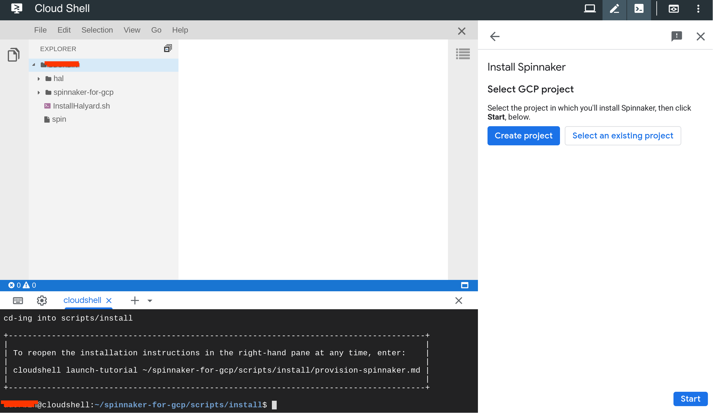
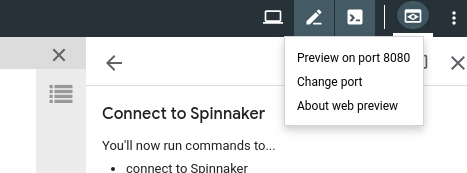
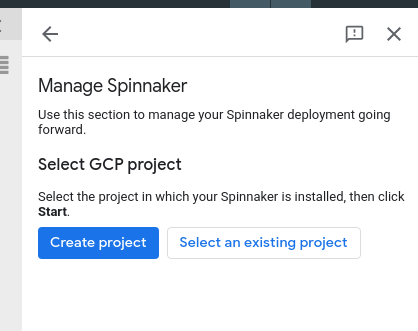
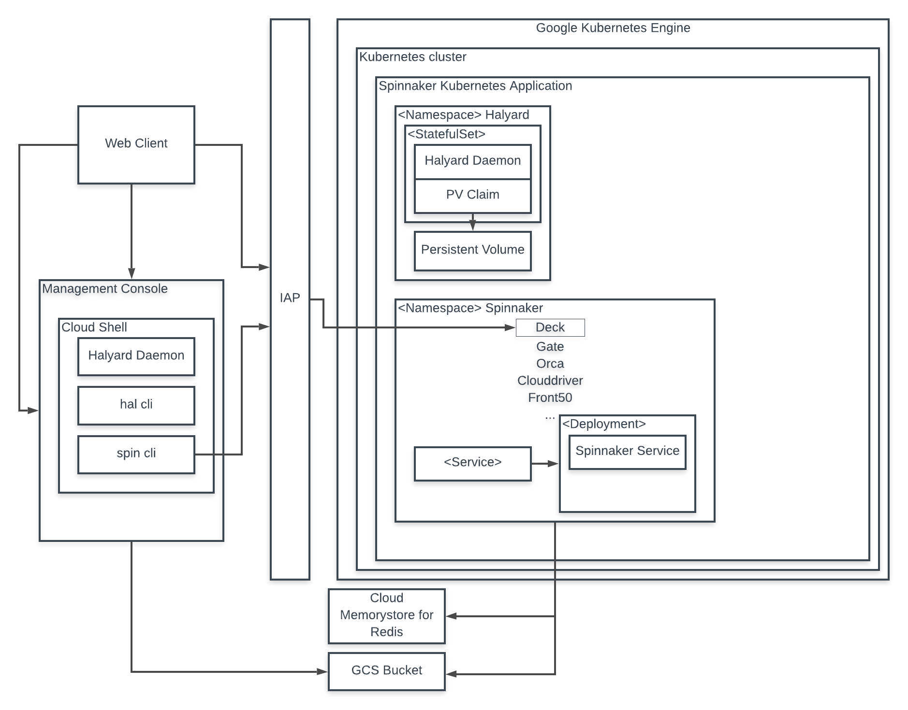

# Install and manage Spinnaker on Google Cloud Platform

Spinnaker on Google Cloud Platform is a tool for easily installing a production-ready instance of Spinnaker, and for managing that instance over time.

## Do I want to use this solution?

This solution is for…

* Anyone who wants an easy path to install open-source Spinnaker, in a
production-ready configuration, on Google Cloud Platform

* Anyone who wants to "kick the tires" of Spinnaker, to decide if it's the right
CD solution for their needs

* Administrators who will manage one or more long-running instances of
Spinnaker, including adding additional administrators, adding accounts,
upgrading, and so on

This solution gives you...

* Google recommendations and best practices for installing and running Spinnaker
on GCP

* Pre-integration with many other services that Spinnaker is commonly used with

* Sample applications and other helpers for a smoother experience


## What is this solution?

Spinnaker for Google Cloud Platform is a solution for installing and managing
Spinnaker on Google Cloud Platform. It consists of an installation and
management console, Spinnaker and its microservices, and sample applications.

### What is Spinnaker?

Spinnaker is an open source, multi-cloud continuous delivery platform for
releasing software changes with high velocity and confidence.

If you would like to learn more about Spinnaker, please visit the
[Spinnaker website](https://www.spinnaker.io).

### What is Deck?

Deck is the Spinnaker UI. You access Deck in one of the following ways:

* Via port forwarding

  The management console provides a command for forwarding port 8080, and a
  button to click to access Deck via that port.

* Over the internet, on a publicly available domain

  This domain is secured with [Identity-Aware Proxy](https://cloud.google.com/iap).

### The management console

The management console makes it easy for you to do the following:

* Install Spinnaker

  Spinnaker for Google Cloud Platform makes it easy to get a working version of
  open-source Spinnaker running on Google Kubernetes Engine. After it's
  installed, you can make it available to your users. The installation flow
  begins in the management console after you start the solution.

* Manage Spinnaker

  Use this same management console to manage/operate your Spinnaker
  installation, including adding administrators, and creating accounts for
  deploying to additional GKE clusters or other providers.

  The management flow begins after you finish installing Spinnaker. You can also
  open it directly via a link from the GKE Applications page in the Google Cloud
  Console.

The management console uses Cloud Shell, with instructions shown in a guide on
the right-hand side of the window. The guide shows the commands that will be
run, and you can click those commands to copy them into Cloud Shell and run them
there.

### What is Cloud Shell?

[Cloud Shell](https://cloud.google.com/shell) is a tool in Google Cloud Platform
that provides command-line access to GCP.

### How do I find and restore the instructions?

* If the instructions in the right-hand pane disappear, just enter the following
command in Cloud Shell:

```bash
cloudshell launch-tutorial ~/spinnaker-for-gcp/scripts/install/provision-spinnaker.md
```

* If you need to find your way back to the management console, you can relaunch
it by following the instructions under Install Spinnaker on Google Cloud
Platform.

* Refer back to this document if you get lost.

## Am I billed for this?

You are billed for Google Cloud Platform resources that are installed as part of
Spinnaker for Google Cloud Platform.

* [Google Kubernetes Engine](https://cloud.google.com/kubernetes-engine/)
* [Cloud Memorystore for Redis](https://cloud.google.com/memorystore/docs/redis/)
* [Google Cloud Load Balancing](https://cloud.google.com/load-balancing/)

...and possibly other resources, depending on the options you select when you
install and configure Spinnaker. You can use the [Google Cloud Platform Pricing
Calculator](https://cloud.google.com/products/calculator/) to estimate the cost
of this solution.

[Learn more about Google Cloud pricing](https://cloud.google.com/pricing/) &
[free trial](https://cloud.google.com/developers/startups/).

## Install and use Spinnaker on Google Cloud Platform

You access this solution by clicking the **Go to Spinnaker for Google Cloud
Platform** button on the [Spinnaker for GCP 
page](https://console.cloud.google.com/marketplace/details/google-cloud-platform/spinnaker)
in Marketplace.

After you've installed Spinnaker for Google Cloud Platform, you can access
Spinnaker and the management console from [Google Cloud
Console](https://console.cloud.google.com/kubernetes/application).

> Note: Spinnaker for Google Cloud Platform doesn't support regional clusters.
> If you intend to [install Spinnaker on an existing
> cluster](#install_spinnaker_on_existing_cluster), it must be zonal.

> Note: Google recommends that you deploy your resources using an account other
> than `spinnaker-install-account`. That account is used to install your
> spinnaker instance, and resources deployed using that account are installed
> into the spinnaker namespace by default. This namespace is not indexed, so
> your deployments will time out before they are deemed stable.

### Install Spinnaker on Google Cloud Platform

1. Start the solution from the [Spinnaker for GCP Marketplace
page](https://console.cloud.google.com/marketplace/details/google-cloud-platform/spinnaker)
by clicking the **Go to Spinnaker for Google Cloud Platform** button.

1. When prompted to Open in Cloud Shell, click **Proceed**.

  Cloud Shell opens, along with a file tree showing the files in the Spinnaker
  repository, and instructions.



  > **Important:** If you've launched the management console at least once before,
  > you might be prompted, in the shell, to resume with the clone you created
  > before, update that clone, or clone a new copy of the repository. The first
  > option is best (`cd` into the existing directory). Don't clone a new copy.

  The spinnaker-for-gcp repository is cloned into your Cloud Shell.

1. Follow the instructions shown on the screen.

The flow in the management console guides you through the installation process,
presenting you with commands, which you can copy to the Cloud Shell prompt and
then execute by pressing **Enter**. The commands run scripts that automate the
process of installing Spinnaker on GKE.

If the instruction pane disappears at any time, you can restore it using the
following command, from Cloud Shell:

```bash
cloudshell launch-tutorial ~/cloudshell_open/spinnaker-for-gcp/scripts/install/provision-spinnaker.md
```

### Access Spinnaker

After you've installed Spinnaker, you can execute a command to forward ports,
which allows you to access the Deck UI and start using Spinnaker. You can share
the port-forwarding command with your users, and if they have access to the GKE
cluster, they can reach Deck (the Spinnaker UI) on port 8080.

Alternatively, you can expose Spinnaker over the public internet, secured using
[Identity-Aware Proxy](https://cloud.google.com/docs/ci-cd/spinnaker/spinnaker-for-gcp#expose_iap).

Both alternatives are described below.

#### Access Spinnaker by forwarding ports

You can run a command in Cloud Shell in the management console, to forward ports
so you can access Spinnaker from localhost:8080.

1. Click to copy the `connect_unsecured.sh` command in the management console,
and press **Enter**.

  This forwards the local port 8080 to port 9000 (the port Deck uses) on the pod
  running Deck.

1. Click the "Connect to Spinnaker…" link. This highlights the Preview button.

1. Click the highlighted preview button, and select **Preview on port 8080**.



  > **Note:**There is a "Connect to Spinnaker" link displayed. If you click it,
  > it highlights the preview button, which you then click to select the port.

Deck, the Spinnaker user interface, opens in your browser. The Spinnaker
documentation site has instructions for using Spinnaker.

Back in the management console, there are a few other things you can do:

* Make Spinnaker securely available to your teams without having to forward
ports
* View the Spinnaker audit log
* View logs from Spinnaker microservices
* Click **Next** to move on to the Spinnaker management portion of the solution.
* Share the port-forwarding command with your users If they have access to the
GKE cluster, they can reach Deck (the Spinnaker UI) on port 8080.

### Give your users access to Spinnaker over the internet

The console includes a command that helps you create a secure endpoint from
which to expose Spinnaker to your users, securely, over the internet.

> **Note:** If you need to keep Spinnaker private, you can set up port
> forwarding for your users. 

1. Navigate to step 2 of the installation flow in the Management console
("Connect to Spinnaker").

1. Under "Expose Spinnaker publicly," click the button to copy the command to
the command line, and press **Enter**.

  The script creates a new endpoint from which to serve your Spinnaker instance.
  After the script finishes, the guidance in the console changes to show
  instructions for setting up OAuth so that your users can access this endpoint.

1. Follow those on-screen instructions.

  Make sure when you create your OAuth credentials that you copy the generated
  client ID and secret. You'll need to provide them when prompted by the script.

> **Note:** This process can take up to an hour, even if it appears that the
> script has finished.

You now have a Spinnaker endpoint that you can share with your users, who
authenticate into it using OAuth2. A link to Spinnaker is displayed in the
management console. There is also a link on the GKE applications page for this
Spinnaker instance.

### Manage Spinnaker

Use the management console to manage your spinnaker instance, including the
following actions:

* Add administrators (operators)

* Add cloud provider accounts

  A provider is the cloud environment (for example, Google Compute Engine) where
  you deploy your applications

* Upgrade Spinnaker

* Invoke Halyard commands to configure Spinnaker

* Invoke spin commands to manage Spinnaker resources, like applications and
pipelines

1. Access the management portion of this console.

   Use one of the following options:

   **If the console is already open:**

   1. At the end of the installation flow, click **Next**.

   1. Copy the command on the Next steps page and press **Enter**.

      The instructions pane changes to start the management process.

      

   **If the console is not already open:**

   1. Go to the Google Kubernetes Engine applications page.

   1. Open the Spinnaker application.

      The application description includes a link: Open Management Environment
      in Cloud Shell.

   1. Click that link to open the management console, which now starts with the
   management/admin functionality.

      

   1. Select your GCP project, and click Start.

#### Add administrators for your Spinnaker instance

You can give access to more operators, who can then use the management console.

1. On the [IAM permissions page](https://console.developers.google.com/iam-admin/iam),
grant the person the 'Owner' role on the GCP project where you've installed Spinnaker.

1. If you are serving Spinnaker on an IAP-secured endpoint, and if the person to 
whom you're giving operator rights doesn't already have *user* access, use the
following command (which is also on step 5 of the management part of the
console):

   ```bash
   ~/spinnaker-for-gcp/scripts/manage/grant_iap_access.sh
   ```

   ...and follow the instructions on the Cloud Shell command line.

#### Add cloud provider accounts

You can use the management console to add accounts for as many cloud providers
[as Spinnaker supports](https://www.spinnaker.io/setup/install/providers/).
You'll need one for each cloud on which your users intend to deploy
applications. For example, if they will deploy applications to Google Compute
Engine and AWS, you'll add a provider account for each.

The management console includes the following command, for adding a GKE account:

`~/spinnaker-for-gcp/scripts/manage/add_gke_account.sh`

And for Google Compute Engine:

`~/spinnaker-for-gcp/scripts/manage/add_gce_account.sh`

And for Google App Engine:

`~/spinnaker-for-gcp/scripts/manage/add_gae_account.sh`

You can run these commands from the management console or enter them in Cloud
Shell against an existing Spinnaker instance.

#### Run Halyard commands

You can invoke [any hal command](https://www.spinnaker.io/reference/halyard/commands)
to configure and administer your Spinnaker installation.

To do so, just invoke the command from the Cloud Shell in the management
console, *after* you've installed Spinnaker

#### Upgrade Spinnaker

1. Find out the version you want to upgrade to.

   The [Versions page](https://www.spinnaker.io/community/releases/versions)
   lists the stable versions available.

1. In the console, navigate to the management flow:

   `~/spinnaker-for-gcp/scripts/manage/update_console.sh`

1. Click **Next** until you see the screen titled "Scripts for Common Commands."

1. Under "Upgrade Spinnaker," copy the first command to the shell, and press
**Enter**.

   That command is...

   ```bash
   cloudshell edit \
    ~/spinnaker-for-gcp/scripts/install/properties
    ```

1. Edit the Spinnaker version in the `properties` file that is displayed.

   ```bash
   export SPINNAKER_VERSION=1.19.3
   ```

   The [Spinnaker Versions page](https://www.spinnaker.io/community/releases/versions)
   shows the latest versions avaiable.

1. Use the following command to invoke Halyard to apply the changes:

   ```bash
   ~/spinnaker-for-gcp/scripts/manage/update_spinnaker_version.sh
   ```

## Restart the management console

If you need to restart the console for any reason (for example, you closed the
tab or window), you can restart it in the same way that you
[started it](https://console.cloud.google.com/marketplace/details/google-cloud-platform/spinnaker).
You can also launch it from the [GKE Applications
page](https://console.cloud.google.com/kubernetes/application) in the Google
Cloud Console, if you've previously installed Spinnaker for Google Cloud
Platform.

When you restart the console, it prompts you to resume from where you left off, if you want.


## Upgrade the management console

1. In the management console, navigate to step 3, "Scripts for Common Command,"
and scroll to the bottom of the page.

1. Run the command shown under "Upgrade Management Environment."

The management console is upgraded to include the latest changes.

## Remove Spinnaker for Google Cloud Platform

> **Warning:** If you installed Spinnaker on pre-existing infrastructure (GKE
> cluster, Redis, service accounts), this script deletes those items. If you
> want to keep them, edit the generated cleanup script
> (`~/spinnaker-for-gcp/scripts/manage/generate_deletion_script.sh`) to comment
> out the specific deletion commands for items you want to keep.

If you want to remove Spinnaker for any reason:

1. Open the management console and click Next until you get to the "Delete
Spinnaker" page.

1. Copy the command to the Cloud Shell terminal, and press **Enter**.

All resources that were created for this Spinnaker instance, and any existing
resources on which you might have deployed, are deleted.

## Sample Applications

The Spinnaker for Google Cloud Platform solution comes with sample applications
to help you get started with Spinnaker.

To install them:

1. In the management console, click **Next** until you get to the step titled
"Use Spinnaker."

1. Under **Install sample applications and pipelines**, click the button to
paste the command, and press **Enter**.

   Cloud Shell returns a list of available sample apps, numbered.

1. Press the number corresponding to the application you want, or the number
corresponding to "Quit" to exit without installing any.

1. Press Enter

   The tutorial pane now displays guidance for the sample application.

1. To exit the sample app and return to the management portion of the console,
click **Start** and then **Next**, then scroll to the bottom of the "Start a new
build" page, and run the command under "Return to Spinnaker console."

## Other considerations

### Spinnaker for GCP architecture

Spinnaker and its microservices are installed on GKE using the following
architecture:



### Install Spinnaker on an existing cluster

You can install your Spinnaker instance or instances on pre-existing
infrastructure, instead of having this solution create it new.

The cluster must have the following:

* IP aliases enabled, because this uses a hosted Redis instance

* Full Cloud Platform scope for its nodes if you're using the project default
service account

Before you run the installation script, do the following:

1. Copy and run the following command (which is also available in step 1 of the
installation flow):

   ```bash
   cloudshell edit \
       ~/spinnaker-for-gcp/scripts/install/properties
   ```

   The properties file is opened in the file editor.

1. Edit this section of the `properties` file to identify the Kubernetes cluster
on which to install Spinnaker:

   ```bash
   # If cluster does not exist, it will be created.
   export GKE_CLUSTER=$DEPLOYMENT_NAME
   export ZONE=us-west1-b
   export REGION=us-west1
   ```

1. Similarly, edit other properties to identify other existing infrastructure
and accounts that you want to use, if applicable.

   For example an existing Cloud Memorystore Redis instance, or a bucket or a
   service account. In each case, if the infrastructure doesn't exist, the
   installation script creates it for you.

### Manage multiple Spinnaker installations

If you run multiple Spinnaker instances, they must be on separate clusters, and therefore in different Kubernetes contexts.

> **Important:** If you're trying to install multiple Spinnaker instances, don't
clone multiple copies of the spinnaker-for-gcp repo.

To manage one of those installations:

1. Get your credentials.

   ```bash
   gcloud container get-credentials
   ```

1. Switch to the appropriate Kubernetes context.

   ```bash
   kubectl config use-context <CONTEXT_NAME>
   ```

1. Pull the configuration stored in that cluster.

   ```bash
   ~/spinnaker-for-gcp/scripts/manage/pull_config.sh
   ```

The config now in `~/spinnaker-for-gcp/scripts/install/properties` is the one
for that Spinnaker instance. Perform the usual management tasks available to
you, including running `hal` commands. Spinnaker applies those commands to the
Spinnaker instance in the chosen context.

